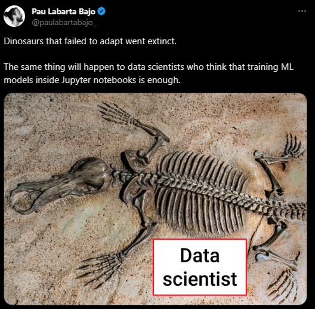
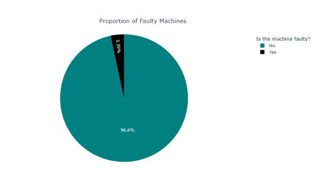
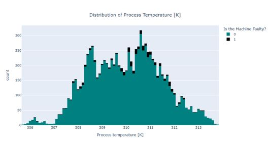

<h1 style="text-align: center;">Binary Classification of Machine Failures</h1>

<h3>A machine leanring web app which involves predicting whether a machine fails or not</h3>

You can view the live demo <a href="#">here</a>

<h2>Table of Contents</h2>

- [Overview and Objective](#overview_objective)
- [Dataset](#data)
- [Insights from EDA](#insights)
- [Models and Evaluation Metrics](#model)
- [Model Selection - Conclusion](#conclusion)
- [Resources and References](#reference)

<h2>Overview</h2>

<h2>Dataset</h2>

The dataset used in this project contains the information of 10000 samples of vehicles. Key features of the dataset include attributes related to various aspects of a vehicle such as <strong>rotation speed</strong>, <strong>tool wear</strong>, and so on. The link to the dataset as well as the description can be found on <a href="https://www.kaggle.com/datasets/dineshmanikanta/machine-failure-predictions">Kaggle.</a>

<h2>Insights from EDA</h2>

My primary aim is not to build the 'perfect model' by performing extensive analysis and feature engineering. Rather, my aim is to get started with some MLOps practices. In this vein, this project contains the minimal EDA and data preprocessing - I hope to gradually build and extend my knowledge as I complete more tasks. However, below are some of the insights drawn from the data due to the little EDA I have performed

- The proportion of faulty to non-faulty machines is highly imbalanced

- Faulty machines seem to have a <code>Process Temperature [K]</code> of around 308 - 312.

